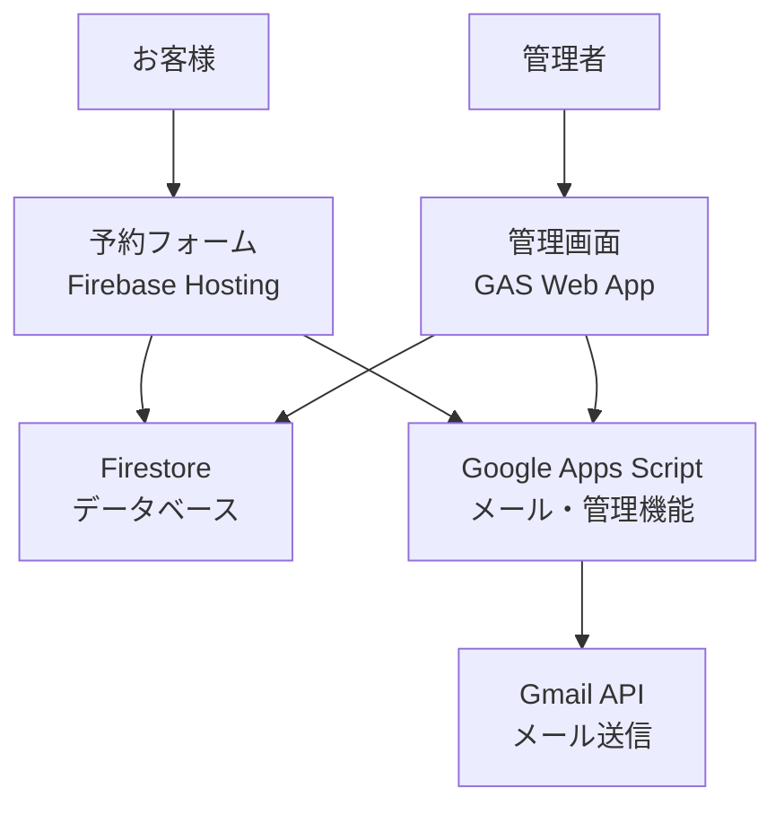

# 🍞 カンパーニュ予約システム

## 概要

**カンパーニュ予約システム**は、パン屋「カンパーニュ（Campagne）」の商品受取予約を管理するWebアプリケーションです。お客様がオンラインで商品を予約し、指定の日時に店舗で受け取れるシステムです。

### 主な特徴

- 📅 **営業日対応**: 水曜日・土曜日のみの営業に対応
- 🚫 **臨時休業管理**: 管理画面から休業日を設定可能
- 📧 **自動メール送信**: 予約確認メールと当日リマインダー
- 🛡️ **CORS回避**: 複数の通信手法でブラウザ制限を回避
- 📱 **レスポンシブ**: モバイル・デスクトップ両対応
- 🎨 **田園風デザイン**: パン屋らしい温かみのあるUI

## システム構成



### 技術スタック

- **フロントエンド**: HTML5, CSS3, JavaScript (ES6+)
- **バックエンド**: Firebase Firestore, Google Apps Script
- **認証**: Firebase Authentication（管理画面のみ）
- **メール**: Gmail API
- **ホスティング**: Firebase Hosting
- **スタイル**: カスタムCSS（レスポンシブデザイン）

## ファイル構造

```
campagne-reservation/
├── public/                    # 公開ディレクトリ
│   ├── index.html            # メイン予約フォーム
│   ├── common/
│   │   └── time.js           # 営業日・時間ユーティリティ
│   └── 404.html              # エラーページ
├── gas/                      # Google Apps Script
│   ├── code.js               # メイン処理（CORS対応）
│   ├── AdminIndex.html       # 管理画面UI
│   └── appscript.json        # GAS設定
├── data/
│   └── products_seed.json    # 商品初期データ
├── tests/                    # テストファイル
│   ├── rules.spec.js         # Firestoreルールテスト
│   └── browser/
│       └── test_time.html    # time.jsテスト
├── firebase.json             # Firebase設定
├── firestore.rules           # Firestoreセキュリティルール
├── firestore.indexes.json    # Firestoreインデックス
└── package.json              # テスト依存関係
```

## 機能一覧

### 🛒 お客様向け機能（予約フォーム）

1. **受取日時選択**
   - 営業日（水・土）のみ選択可能
   - 臨時休業日は自動除外
   - 11:00〜17:00の30分刻みスロット

2. **商品選択**
   - 商品一覧の動的表示
   - 数量指定（0〜20個）
   - リアルタイム合計金額計算

3. **顧客情報入力**
   - 名前、メールアドレス（必須）
   - 電話番号、備考（任意）
   - フォームバリデーション

4. **支払方法選択**
   - 現金またはPayPay

5. **予約確定**
   - Firestoreへの安全な保存
   - 予約番号自動生成
   - 確認メール自動送信

### 🔧 管理者向け機能（管理画面）

1. **予約管理**
   - 期間・支払方法・状態での絞り込み
   - ステータス更新（引渡済み・取消済み）
   - CSV出力機能

2. **商品管理**
   - 商品の追加・編集・削除
   - 価格設定
   - 販売可否・季節商品フラグ
   - 並び順設定

3. **休業日管理**
   - 臨時休業日の登録・削除
   - 理由付きでの管理

4. **システム監視**
   - 管理者権限確認
   - 処理状況の表示

### 📧 自動メール機能

1. **予約確認メール**
   - 予約直後に自動送信
   - 予約詳細（番号、日時、商品、金額）
   - 店舗情報・注意事項

2. **当日リマインダー**
   - 受取日当日の朝8時に送信
   - 日次トリガーで自動実行

## セットアップ手順

### 1. Firebase プロジェクト作成

```bash
# Firebase CLI インストール
npm install -g firebase-tools

# Firebase ログイン
firebase login

# プロジェクト初期化
firebase init
```

**有効化サービス**:
- Firestore Database
- Authentication
- Hosting

### 2. Firebase 設定

#### firestore.rules
```javascript
// 商品データ：誰でも読取可、管理者のみ書込可
// 予約データ：誰でも作成可、管理者のみ読取・更新・削除可
// 詳細は firestore.rules ファイルを参照
```

#### Authentication 設定
1. Authentication > Sign-in method
2. メール/パスワードを有効化
3. 許可ドメインに `script.googleusercontent.com` を追加

#### 管理者設定
```javascript
// Firestoreにて以下ドキュメントを作成
db.collection('settings').doc('admins').set({
  emails: ['admin@example.com']  // 管理者メールアドレス
});
```

### 3. 商品データ初期化

```bash
# data/products_seed.json を参考に商品データをFirestoreに追加
```

### 4. Google Apps Script 設定

1. [Google Apps Script](https://script.google.com) で新プロジェクト作成
2. `gas/code.js` の内容をコピー
3. `gas/AdminIndex.html` をHTMLファイルとして追加
4. 必要な API を有効化:
   - Gmail API
   - Script API

#### GAS環境変数設定
```javascript
// スクリプトプロパティに以下を設定
API_KEY: "your-secure-api-key"
ADMIN_EMAIL: "admin@example.com"
```

#### GAS Web App デプロイ
1. 「デプロイ」> 「新しいデプロイ」
2. 種類: ウェブアプリ
3. アクセス権: 全員
4. デプロイURLを取得

### 5. フロントエンド設定

`public/index.html` の以下設定を更新:

```javascript
// Firebase設定
const firebaseConfig = {
  apiKey: "your-api-key",
  authDomain: "your-project.firebaseapp.com",
  projectId: "your-project-id",
  // ...
};

// GAS設定
const GAS_ENDPOINT = "your-gas-webapp-url";
const GAS_API_KEY = "your-secure-api-key";
```

### 6. デプロイ

```bash
# Firebase にデプロイ
firebase deploy
```

## 営業ルール

### 営業日・営業時間
- **営業日**: 水曜日・土曜日のみ
- **営業時間**: 11:00〜17:00
- **予約時間**: 30分刻み（11:00, 11:30, 12:00...17:00）

### 商品カテゴリ
- プレミアムカンパーニュ
- レーズン&クルミ系
- ナッツ・ドライフルーツ系
- フレーバーパン（アールグレイ、チョコレート等）
- 惣菜パン（カレーパン、ピザ等）
- 季節限定商品

### 予約ルール
- 営業日のみ予約可能
- 臨時休業日は管理画面で設定
- 過去日時は選択不可
- 1回の予約で最大20個まで

## CORS対応について

本システムは以下の手法でCORS制限を回避します：

### 1. JSONP通信
```javascript
// コールバック関数による非同期通信
sendToGAS_JSONP(path, data)
```

### 2. フォーム送信フォールバック
```javascript
// 隠しiframeを使ったフォーム送信
sendToGAS_Form(path, data)
```

### 3. 自動リトライ機構
- 複数手法の順次試行
- 指数バックオフによる再試行
- エラー詳細ログ

## セキュリティ

### Firestore セキュリティルール
- 商品データ: 読取り公開、書込み管理者のみ
- 予約データ: 作成は誰でも可、読取り・更新・削除は管理者のみ
- バリデーション: 必須フィールド、データ型、未来日時チェック

### GAS API認証
- API キーによる認証
- リクエスト検証
- 管理者メール確認

## テスト

### Firestore ルールテスト
```bash
npm install
npm run test:rules
```

### ブラウザテスト
```bash
# tests/browser/test_time.html をブラウザで開く
```

## トラブルシューティング

### よくある問題

#### 1. CORS エラー
```
Access to fetch at 'GAS_URL' from origin 'firebase-domain' has been blocked by CORS policy
```
**解決策**: システムが自動的にJSONPフォールバックを実行します

#### 2. Firebase Authentication エラー
```
FirebaseError: Missing or insufficient permissions
```
**解決策**: 
- settings/admins ドキュメントの作成確認
- 管理者メールアドレスの正確性確認

#### 3. メール送信失敗
```
Gmail API quota exceeded
```
**解決策**:
- GAS実行回数制限の確認
- Gmail API使用量確認

### デバッグ機能

フロントエンドには詳細なデバッグ機能があります：

1. 「システム診断情報の表示切り替え」ボタンクリック
2. リアルタイムログ表示
3. 通信手法・エラー詳細の確認

## ライセンス

このプロジェクトは教育・商用利用目的で作成されています。
Firebase、Google Apps Script等の利用は各サービスの利用規約に従ってください。

## 貢献

バグ報告や機能改善の提案は、Issues または Pull Request でお願いします。

---

**カンパーニュ予約システム** - 美味しいパンと温かい体験をお客様に 🍞✨